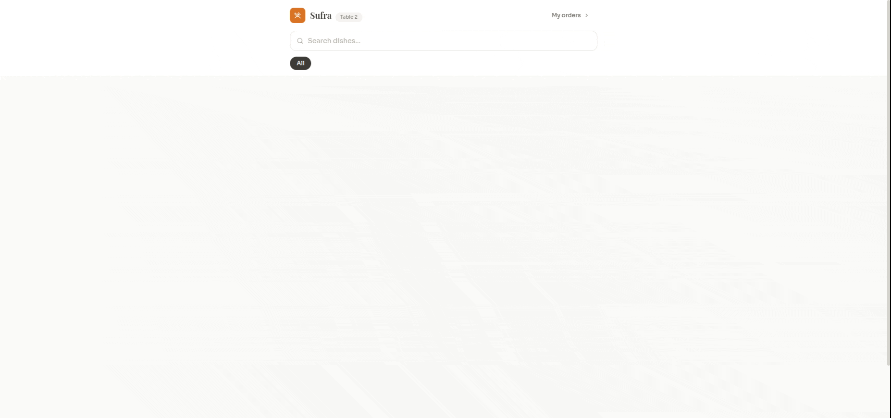

# Sufra — Smart Restaurant Frontend
 
A React-based frontend for a QR-ordering and restaurant management system. Customers scan a table QR code to browse the menu, place orders, and request the bill — while staff manage everything through role-specific dashboards with real-time updates via Socket.IO.
 

---
 
## Tech Stack
 
| Tool | Purpose |
|------|---------|
| React 18 | UI framework |
| Vite | Build tool & dev server |
| React Router v6 | Client-side routing |
| Zustand | Global state (auth, cart) |
| Axios | HTTP client |
| Socket.IO Client | Real-time events |
| Tailwind CSS v3 | Styling |
| react-hot-toast | Toast notifications |
| lucide-react | Icons |
 
---
 
## Project Structure
 
```
src/
├── components/
│   └── layout/
│       └── StaffLayout.jsx      # Shared sidebar + topbar for staff roles
├── hooks/
│   └── useSocket.js             # Socket.IO singleton + event subscription hook
├── lib/
│   └── api.js                   # Axios instance, auth interceptors, SOCKET_URL
├── pages/
│   ├── customer/
│   │   ├── CustomerMenu.jsx     # QR menu — browse, search, add to cart
│   │   ├── CustomerCart.jsx     # Cart review & order placement
│   │   └── CustomerBill.jsx     # Live order tracking + call waiter / request bill
│   ├── admin/
│   │   ├── AdminDashboard.jsx   # Sales stats + top-selling items
│   │   ├── AdminMenu.jsx        # CRUD for menu items
│   │   ├── AdminCategories.jsx  # CRUD for categories
│   │   ├── AdminTables.jsx      # Table management + QR code display
│   │   ├── AdminOrders.jsx      # All orders with status controls
│   │   └── AdminStaff.jsx       # User management (add / delete staff)
│   ├── chef/
│   │   └── ChefKDS.jsx          # Kitchen Display System — 3-column Kanban
│   ├── cashier/
│   │   ├── CashierDashboard.jsx # Table map + live bill/waiter notifications
│   │   └── CashierBill.jsx      # Per-session bill detail + checkout
│   └── LoginPage.jsx
├── store/
│   ├── authStore.js             # Zustand — user, token, login/logout
│   └── cartStore.js             # Zustand (persisted) — cart items, session, table
├── App.jsx                      # Route definitions + role-based guards
├── main.jsx                     # React entry point
└── index.css                    # Tailwind layers + design-system component classes
```
 
---
 
## Getting Started
 
### Prerequisites
 
- Node.js ≥ 18
- A running instance of the Sufra backend API
> **Backend:** [sufra-backend](https://github.com/hussainALJ/smart-rest-back)
 
### Installation
 
```bash
# Clone the repo and install dependencies
npm install
 
# Copy the environment template and fill in your API URL
cp .env.example .env
```
 
**.env**
```
VITE_API_URL=http://localhost:3000
```
 
### Development
 
```bash
npm run dev
# Starts Vite dev server on http://localhost:5173
```
 
### Production Build
 
```bash
npm run build      # Outputs to /dist
npm run preview    # Previews the production build locally
```
 
### Deployment (Vercel)
 
`vercel.json` is included and rewrites all routes to `index.html` for SPA navigation. No extra configuration is needed — just point Vercel at this repo and set the `VITE_API_URL` environment variable in the Vercel dashboard.
 
---
 
## User Roles & Routes
 
| Role | Entry Point | Access |
|------|-------------|--------|
| **Customer** | `/menu?table=<id>` | Menu, Cart, Bill — no login required |
| **Admin** | `/admin` | All staff routes + full management |
| **Chef** | `/chef` | Kitchen Display System only |
| **Cashier** | `/cashier` | Tables, billing, checkout |
| **Waiter** | `/cashier` | Same view as Cashier |
 
Role is decoded from the JWT payload on login and stored in `localStorage` via Zustand.
 
---
 
## Customer Flow
 
1. Customer scans QR code on the table → lands on `/menu?table=<id>`
2. A session is automatically started (or rejoined) via `POST /api/sessions/start`
3. Customer browses, searches, and filters the menu by category
4. Items are added to the cart (persisted across page refreshes via `zustand/persist`)
5. Customer reviews the cart at `/cart`, adds per-item notes, and places the order
6. `/bill/<sessionId>` shows live order status (updated via Socket.IO), and lets the customer call a waiter or request the bill
 
---
 
## Real-Time Events
 
The frontend uses a singleton Socket.IO connection (`getSocket()` in `useSocket.js`). On connect, the socket joins a room based on the user's role or table ID.
 
| Event (received) | Used by | Description |
|------------------|---------|-------------|
| `newOrder` | Chef KDS | Triggers toast + reloads orders |
| `statusUpdate` | Chef KDS, Customer Bill | Reloads order/session data |
| `requestBill` | Cashier Dashboard | Shows in-app notification card |
| `callWaiter` | Cashier Dashboard | Shows in-app notification card |
 
| Event (emitted) | Emitted from | Description |
|-----------------|-------------|-------------|
| `join` | On connect | Joins a role/table room |
| `callWaiter` | Customer Bill | Notifies cashier |
| `requestBill` | Customer Bill | Notifies cashier |
 
---
 
## Design System
 
Global component classes are defined in `src/index.css` using `@layer components`. This keeps JSX clean and consistent across pages.
 
| Class | Description |
|-------|-------------|
| `.btn-primary` | Brand-coloured filled button |
| `.btn-secondary` | White outlined button |
| `.btn-ghost` | Transparent hover button |
| `.btn-danger` | Red filled button |
| `.card` | White rounded card with shadow |
| `.input` | Styled text input / select |
| `.label` | Uppercase field label |
| `.badge` | Inline status chip |
| `.badge-pending/preparing/ready/…` | Status-specific badge variants |
| `.sidebar-link` / `.sidebar-link-active` | Navigation items |
| `.skeleton` | Animated loading placeholder |
| `.page-title` / `.page-subtitle` | Page heading styles |
 
Custom colours (`brand`, `surface`), fonts (`Sora`, `Playfair Display`, `JetBrains Mono`), shadows, and keyframe animations are defined in `tailwind.config.js`.
 
---
 
## Environment Variables
 
| Variable | Required | Description |
|----------|----------|-------------|
| `VITE_API_URL` | Yes | Base URL for the backend REST API and Socket.IO server |
 
---
 
## Scripts
 
| Script | Description |
|--------|-------------|
| `npm run dev` | Start Vite development server |
| `npm run build` | Production build to `/dist` |
| `npm run preview` | Serve the production build locally |
